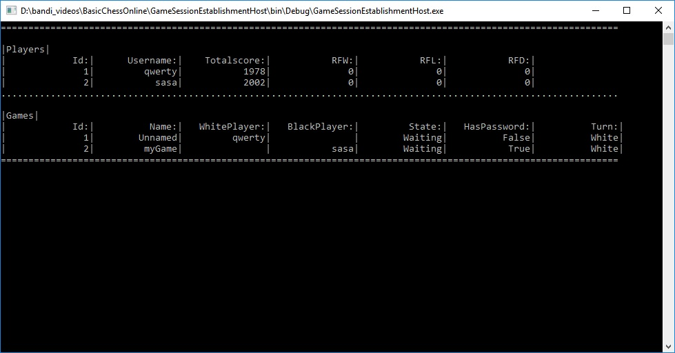

# BasicChessOnline
The BasicChessOnline is a client-server solution for playing chess over the Internet. You can authentificate on the server,
create new games or connect to existing games. App use ELO system for calculate rating.
GUI was developed using Prism library and WPF, chess logic was implement using ChessDotNet library, 
server side was developed using WCF Services. For connection to the database app uses Entity Framework. Set ChessClient as startup project for launch client.
Set GameSessionEstablishmentHost as startup project for launch services.

Server side: 

Gameplay: 

